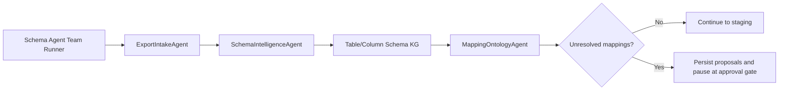

# Executable Schema Agent Team

This milestone converts the first three migration agent descriptors into executable, persisted agents.



## ExportIntakeAgent

The intake agent verifies registered file paths, hashes, table identities, and the export fingerprint. It does not use an LLM.

## SchemaIntelligenceAgent

The schema agent checks for profiles, requests profiling only when necessary, builds the isolated Schema Intelligence KG, and requires a clean graph audit. It can execute only the allowlisted `profile_export` and `build_schema_intelligence_kg` tools.

## MappingOntologyAgent

The mapping agent reads unresolved contract decisions, finds same-table candidate columns, asks the configured LLM for structured proposals, applies deterministic guardrails, and persists proposals separately from mapping decisions. It cannot modify the contract or KG.

Allowed proposal actions are:

- `keep_contract_missing`
- `deprecate_contract_column`
- `map_to_observed_column`
- `needs_human`

An observed candidate is mandatory before `map_to_observed_column` is retained. Low-confidence or unsupported model output is downgraded to `needs_human`.

## Tool Control

`AllowlistedToolRuntime` maps fixed tool names to fixed repository scripts. It builds subprocess arguments internally, supplies the configured PostgreSQL connection, and records input hashes, outputs, artifacts, status, agent name, and errors in `migration_tool_execution`. Agents receive no general shell interface.

## Run

```powershell
.\.venv\Scripts\python.exe scripts\migration_v2\22_run_schema_agent_team.py `
  --export-id dg_old_athena_test `
  --env-config configs\migration_v2\local_env.yaml `
  --require-llm `
  --created-by louat
```

The runner resumes the durable workflow run, checkpoints each agent boundary, and creates a `schema_mapping_review` approval request when proposals remain unresolved.

## Current Result

For `dg_old_athena_test`, intake and KG audit pass. Four contract columns are absent from `dict_dico_container`. The LLM found insufficient evidence for automatic remapping or deprecation, so all four remain pending human review. This is expected conservative behavior.
