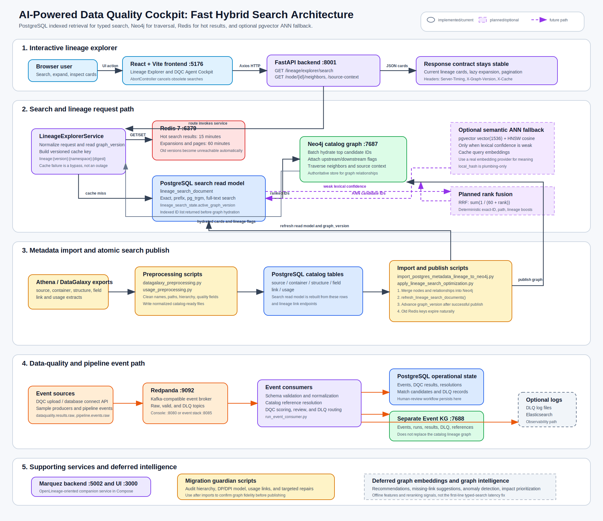

# Fast Hybrid Search Architecture

This document describes the functional architecture of the AI-Powered Data Quality Cockpit and the fast hybrid-search plan for the Lineage Explorer.

The immediate latency problem is typed catalog search across millions of metadata fields. PostgreSQL should answer indexed text searches, Neo4j should hydrate the selected nodes and traverse relationships, and Redis should cache hot responses. Text embeddings and ANN search are an optional fallback for weak lexical matches. Graph embeddings remain a later offline feature.



## Architecture Goal

The target behavior is:

- Cold typed searches under `1s` p95.
- Cached requests under `150ms` p95.
- No regression in lineage cards, lazy expansion, or source-context pagination.
- Search freshness changes only after a successful publish.
- Redis failure degrades to uncached requests instead of breaking search.

The repository already implements much of phases 1 and 2. Phase 3 is partially scaffolded. Reciprocal rank fusion and lineage-search semantic fallback are still planned.

## Deployment Shape

The project has a modular FastAPI backend and several separately deployed infrastructure services. The backend modules are logical application components inside one API process; they are not independently deployed application microservices today.

| Component | Role | Runtime boundary | Status |
| --- | --- | --- | --- |
| React + Vite frontend | DQC cockpit and progressive lineage explorer | Browser application on `:5176` | Implemented |
| FastAPI backend | HTTP API, lineage service, DQC resolution, embeddings, event routes | Python API process on `:8001` | Implemented |
| Redis | Versioned hot-result cache | Container on `:6379` | Implemented |
| PostgreSQL | Catalog tables, indexed search read model, DQC state, event state | Database service on `:5432` | Implemented |
| Neo4j catalog graph | Authoritative lineage traversal graph | Container on `:7687`, browser on `:7474` | Implemented |
| Redpanda | Kafka-compatible event broker | Container on `:9092` | Implemented |
| Redpanda Console | Local event inspection | Container on `:8080` or event-stack `:8085` | Implemented |
| Neo4j Event KG | Separate graph for events, pipeline runs, DQC results, DLQ records, and catalog references | Optional container on `:7688`, browser on `:7475` | Implemented |
| Marquez + Marquez Web | OpenLineage-oriented companion backend and UI | Containers on `:5002` and `:3000` | Present in Compose |
| Elasticsearch | Optional DLQ observability sink | External service configured with `ELASTICSEARCH_URL` | Optional |
| Azure OpenAI embeddings | Meaningful text embeddings for semantic retrieval | External provider | Optional |

The local infrastructure is defined in [docker-compose.yml](../../infra/docker-compose.yml). The separate event knowledge graph stack is defined in [docker-compose.event-kg.yml](../../infra/docker-compose.event-kg.yml).

## Lineage Search Request Flow

The frontend keeps the public API stable:

```text
GET /lineage/explorer/search
GET /lineage/explorer/node/{id}/neighbors
GET /lineage/explorer/node/{id}/source-context
```

The request path is:

1. The React frontend sends a search request through [lineageApi.ts](../../frontend/src/features/lineage/api/lineageApi.ts).
2. [useLineageExplorer.ts](../../frontend/src/features/lineage/hooks/useLineageExplorer.ts) cancels an obsolete search with `AbortController` when a newer query supersedes it.
3. [lineage_explorer.py](../../backend/app/routes/lineage_explorer.py) delegates to [lineage_explorer_service.py](../../backend/app/services/lineage_explorer_service.py).
4. The service reads `lineage_search_state.active_graph_version`, builds a versioned Redis key, and attempts a cache lookup.
5. On a miss, [lineage_explorer_repository.py](../../backend/app/repositories/lineage_explorer_repository.py) retrieves ranked IDs from PostgreSQL.
6. PostgreSQL uses exact ID, normalized label, normalized technical-name, prefix, full-text, path, and trigram branches.
7. Neo4j batch-hydrates the selected IDs and adds upstream/downstream flags.
8. The service caches the result when Redis is available and returns the existing card format.

Redis keys are versioned:

```text
lineage:{graphVersion}:search:{digest}
lineage:{graphVersion}:neighbors:{digest}
lineage:{graphVersion}:source-context:{digest}
```

The implementation hashes the normalized key parts into `{digest}`. Search responses use a `15 minute` TTL. Neighbor and source-context responses use a `60 minute` TTL. Redis errors are swallowed intentionally so the API continues uncached.

The route layer exposes:

```text
Server-Timing
X-Graph-Version
X-Cache
```

These headers allow cold and warm requests to be measured without changing the frontend contract.

## PostgreSQL Search Read Model

The read model is installed by [003_lineage_search_read_model.sql](../../backend/migrations/sql/003_lineage_search_read_model.sql). It builds:

```text
lineage_search_document
lineage_search_state
refresh_lineage_search_documents()
```

`lineage_search_document` collects:

- Sources.
- Containers.
- Structures.
- Fields.
- Usages.
- Additional lineage endpoints from the `link` table, including DP and DPI objects.

The table stores raw and normalized labels, technical names, paths, parent identifiers, a flattened search string, and a generated `tsvector`.

[005_lineage_search_indexes.sql](../../backend/migrations/sql/005_lineage_search_indexes.sql) adds:

- B-tree ID and entity-level indexes.
- Prefix indexes for normalized label and technical name.
- `pg_trgm` GIN indexes for label, technical name, path, and flattened text.
- A GIN index for full-text retrieval.

The installation and first publish are orchestrated by:

```powershell
python scripts/apply_lineage_search_optimization.py
```

Use `--skip-refresh` to install schema only. Use `--include-vector` only after PostgreSQL has been moved to a pgvector-capable image.

## Graph Publish Flow

Catalog metadata begins as Athena or DataGalaxy extracts. The processing and publish path is:

```text
Athena / DataGalaxy exports
  -> preprocessing scripts
  -> PostgreSQL catalog tables
  -> PostgreSQL-to-Neo4j importer
  -> Neo4j catalog graph
  -> refresh_lineage_search_documents()
  -> active_graph_version advances
  -> new Redis cache namespace becomes active
```

The primary scripts are:

| Script | Purpose |
| --- | --- |
| [datagalaxy_preprocessing.py](../../scripts/datagalaxy_preprocessing.py) | Cleans source, container, structure, field, and link extracts; normalizes column names and metadata. |
| [usage_preprocessing.py](../../scripts/usage_preprocessing.py) | Cleans operational usage extracts and prepares catalog-ready usage rows. |
| [import_postgres_metadata_lineage_to_neo4j.py](../../scripts/import_postgres_metadata_lineage_to_neo4j.py) | Loads catalog nodes, hierarchy relationships, usages, typed lineage links, and business-term links into Neo4j; publishes the read model after import. |
| [resolve_usage_links.py](../../scripts/resolve_usage_links.py) | Resolves usage nodes to sources using normalized application-code evidence. |
| [apply_lineage_search_optimization.py](../../scripts/apply_lineage_search_optimization.py) | Installs search migrations, refreshes indexed documents, and creates indexes. |

`refresh_lineage_search_documents()` advances `active_graph_version` only after the staged PostgreSQL read model has been published successfully. This provides an atomic visibility point for indexed search and cache invalidation. Neo4j graph mutations occur earlier in the importer, so a production publish workflow should still treat the complete import plus refresh sequence as one controlled release operation.

## Neo4j Responsibilities

Neo4j is no longer the first-line text search engine. It remains the authoritative relationship graph.

The catalog graph stores:

- `Source`, `Container`, `Structure`, and `Field` hierarchy nodes.
- `DataProcessing` and `DataProcessingItem` lineage nodes.
- `Usage` nodes and source/structure resolution links.
- Typed lineage relationships such as `IS_INPUT_OF`, `IS_OUTPUT_OF`, `FLOWS_TO`, `USES`, and `PART_OF`.
- Context relationships such as `CONTAINS`, `HAS_FIELD`, `HAS_STRUCTURE`, and `HAS_CONTAINER`.

The repository hydrates search results and preserves the card-oriented visual model by separating semantic lineage edges from catalog context edges.

## Frontend Behavior

The lineage explorer is demand-driven:

- Search results initially return compact cards.
- Upstream and downstream expansions load only the requested next step.
- Source cards page structures and fields independently.
- Loading state is scoped to the affected search or card.
- Card layout, grouping, highlighting, and next-step filtering remain client-side concerns.

The user-facing walkthrough is documented in [USER_GUIDE.md](../../frontend/docs/USER_GUIDE.md). Screenshot regeneration helpers are:

```powershell
python frontend/scripts/capture_tsgcode_lineage_screenshot.py
python frontend/scripts/capture_alm_source_usage_screenshot.py
```

## Semantic Search Phase

Semantic retrieval is scaffolded but is not yet wired into the Lineage Explorer search endpoint.

[004_pgvector_ann_optional.sql](../../backend/migrations/sql/004_pgvector_ann_optional.sql) enables:

```text
vector extension
vector(1536) storage
HNSW cosine index
```

The embedding stack is implemented in:

- [provider.py](../../backend/app/embeddings/provider.py)
- [service.py](../../backend/app/embeddings/service.py)
- [repository.py](../../backend/app/embeddings/repository.py)
- [matcher.py](../../backend/app/dqc/resolution/matcher.py)

Today, ANN retrieval is used by DQC catalog matching when pgvector is available. Otherwise the matcher can fall back to Python cosine comparisons over scoped embeddings. The Lineage Explorer still uses lexical PostgreSQL retrieval followed by Neo4j hydration.

Before enabling semantic fallback for interactive lineage search:

1. Switch the PostgreSQL image from `postgres:14` to a PostgreSQL 14-compatible pgvector image.
2. Apply `004_pgvector_ann_optional.sql`.
3. Backfill all searchable embedding rows.
4. Configure a meaningful provider such as `azure_openai`.
5. Add query-embedding caching.
6. Invoke ANN only when lexical confidence is weak.

The default `local_hash` provider is useful for integration plumbing, but it should not be treated as semantic search.

## Planned Rank Fusion

The desired hybrid ranking model is reciprocal rank fusion:

```text
RRF(candidate) = sum(1 / (60 + rank_in_retriever))
```

The current repository uses deterministic lexical branch groups and scores. It does not yet implement RRF. The planned implementation should fuse exact, prefix, trigram, full-text, and semantic ranked lists, then apply deterministic boosts for:

- Exact IDs.
- Exact full paths.
- Entities that have lineage links.

This avoids manually mixing incomparable lexical and cosine score scales.

## DQC And Event Flow

The same backend also supports event-driven quality workflows.

```text
DQC uploads, database connections, or producers
  -> Redpanda raw topics
  -> consumers
  -> schema validation and normalization
  -> catalog resolution
  -> PostgreSQL operational state
  -> separate Event Knowledge Graph
  -> optional DLQ logs and Elasticsearch
```

Relevant modules:

| Module | Responsibility |
| --- | --- |
| [dqc/resolution/routes.py](../../backend/app/dqc/resolution/routes.py) | Upload files, connect a database table, process events, list resolved/unresolved rows, approve or reject reviews. |
| [dqc/resolution/service.py](../../backend/app/dqc/resolution/service.py) | Validate, normalize, retrieve candidates, score matches, route low-confidence items to DLQ. |
| [dqc/consumer.py](../../backend/app/dqc/consumer.py) | Consume DQC events from Redpanda and persist failures. |
| [eventing/consumer.py](../../backend/app/eventing/consumer.py) | Consume both quality and pipeline events. |
| [eventing/event_kg_writer.py](../../backend/app/eventing/event_kg_writer.py) | Write event-family nodes and relationships into the separate Event KG. |

Event-stack operational scripts:

```powershell
python scripts/eventing/create_event_topics.py
python scripts/eventing/create_event_tables.py
python scripts/eventing/init_event_kg.py
python scripts/eventing/run_event_consumer.py
python scripts/eventing/send_sample_events.py
python scripts/eventing/send_bad_event.py
```

The catalog Neo4j graph and the Event KG are intentionally separate. The catalog graph answers lineage traversal questions. The Event KG records runtime evidence such as arrivals, validations, DQC results, pipeline runs, catalog references, and dead-letter events.

## Migration Guardian Scripts

The `scripts/guardian` workflow checks graph fidelity after imports:

| Order | Script | Purpose |
| --- | --- | --- |
| 1 | [01_audit_current_neo4j_vs_postgres.py](../../scripts/guardian/01_audit_current_neo4j_vs_postgres.py) | Compare catalog-node presence between PostgreSQL and Neo4j. |
| 2 | [02_fast_hierarchy_relationship_audit.py](../../scripts/guardian/02_fast_hierarchy_relationship_audit.py) | Audit hierarchy relationships derived from `parent_node_id`. |
| 3 | [03_fast_dp_dpi_lineage_audit.py](../../scripts/guardian/03_fast_dp_dpi_lineage_audit.py) | Audit DP/DPI nodes, relationships, and visual lineage capacity. |
| 4 | [04_repair_dp_dpi_model.py](../../scripts/guardian/04_repair_dp_dpi_model.py) | Repair DP/DPI nodes, `PART_OF`, and derived visual flows. |
| 5 | [05_fast_usage_lineage_audit.py](../../scripts/guardian/05_fast_usage_lineage_audit.py) | Audit usage-like nodes and usage-relevant lineage links. |
| 6 | [06_repair_all_usage_links_from_audit.py](../../scripts/guardian/06_repair_all_usage_links_from_audit.py) | Repair usage-relevant nodes and relationships from PostgreSQL links. |
| 6b | [06b_repair_missing_usage_relationships_only.py](../../scripts/guardian/06b_repair_missing_usage_relationships_only.py) | Apply a narrower missing-relationship repair when full replay is unnecessary. |

These scripts belong in the controlled import and validation workflow. They should run before the final search read-model publish when their repairs affect graph content.

## Current Versus Planned

| Capability | Current repository state | Next change |
| --- | --- | --- |
| PostgreSQL indexed lineage search | Implemented with exact, prefix, path, full-text, and trigram retrieval | Benchmark and tune confidence thresholds |
| Neo4j hydration and traversal | Implemented | Load-test neighbor and source-context requests separately |
| Redis versioned caching | Implemented | Add cache observability dashboards if needed |
| Diagnostic response headers | Implemented | Use in p95 benchmark reports |
| Frontend request cancellation | Implemented for search | Consider cancellation for obsolete expansions if UX requires it |
| Source-context page caching | Implemented through versioned service keys | Validate page-by-page hit behavior |
| pgvector schema | Optional migration exists | Change Compose image and apply migration |
| Full embedding backfill | Not complete | Backfill all searchable rows after publish |
| Semantic Lineage Explorer fallback | Not wired | Add feature-flagged ANN fallback after lexical retrieval |
| Query-embedding cache | Not implemented | Cache by provider, model, normalized query, and graph version |
| RRF | Not implemented | Fuse lexical and semantic ranked lists |
| Graph embeddings | Deferred | Build offline recommendation and anomaly features later |

## Test And Acceptance Plan

Benchmark cold and warm requests for:

```text
Exact IDs
ALM
AGP
OAD
Full paths
Technical names
Typos
Accented labels
```

Verify:

- Cached and uncached responses return identical cards and lineage flags.
- Publishing a new graph version makes old Redis keys unreachable without flushing Redis.
- Redis outage does not break search.
- Exact ID and full-path queries rank the intended entity first.
- Neighbor traversal, source-context pagination, and card loading behavior remain unchanged.
- Search p95 is below `1s`.
- Cached p95 is below `150ms`.

## Deferred Graph Intelligence

Graph embeddings should not be used as the initial latency fix for typed catalog search. Add them later as offline features for:

- Similar-lineage recommendations.
- Missing-link suggestions.
- Anomaly detection.
- Impact-analysis prioritization.
- Reranking when a user searches from an already selected lineage node.

For ordinary search, PostgreSQL text retrieval plus optional ANN fallback is simpler, faster, and easier to measure.

## Configuration Note

The Compose PostgreSQL container is currently configured for the Marquez database. The backend must still receive a valid `POSTGRES_URL` for the catalog and DQC schema it uses. Redis is configured through `REDIS_URL`, and the two Neo4j graphs use separate connection settings:

```text
NEO4J_URI       -> catalog lineage graph
EVENT_NEO4J_URI -> event knowledge graph
```

See [.env.example](../../backend/.env.example) and [config.py](../../backend/app/config.py) for the backend settings.
