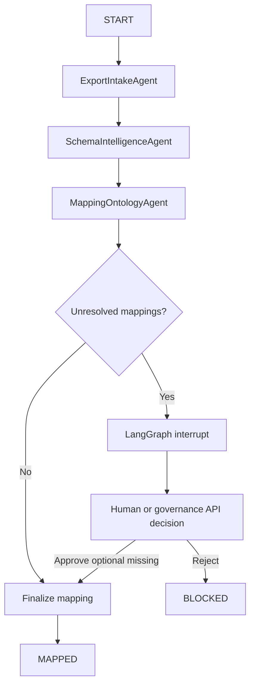

# Persistent LangGraph Orchestrator

Phase 4 replaces the schema-agent sequence with a persistent LangGraph workflow.



## Persistence

LangGraph uses `PostgresSaver` for execution checkpoints. The application also writes operator-facing phase checkpoints and transitions to the migration workflow tables. The top-level checkpoint thread is versioned as `schema-agent-team-v1:<thread_id>`.

Completed tools and mapping proposals are idempotent. Resuming an approval does not call the LLM or rebuild completed phases before the interrupt.

## Start

```powershell
.\.venv\Scripts\python.exe scripts\migration_v2\23_langgraph_schema_orchestrator.py start `
  --export-id dg_old_athena_test `
  --env-config configs\migration_v2\local_env.yaml
```

## Inspect

```powershell
.\.venv\Scripts\python.exe scripts\migration_v2\23_langgraph_schema_orchestrator.py status `
  --run-id eb3675b4-f1aa-4816-98b1-b074ecb2e7e6 `
  --env-config configs\migration_v2\local_env.yaml
```

## Resume

Approval requires one explicit resolution per pending proposal. The currently supported safe action is `keep_contract_missing`; it accepts an optional metadata column as absent for this export without editing the versioned contract.

```json
{
  "decision": "approve",
  "decided_by": "data-steward",
  "rationale": "Optional container metadata is absent in this export; do not infer replacements.",
  "resolutions": [
    {
      "raw_table_name": "dict_dico_container",
      "raw_column_name": "c_techno",
      "action": "keep_contract_missing"
    }
  ]
}
```

The payload must contain every pending mapping. `reject` requires no resolutions and leaves the workflow blocked for investigation.

## API Triggers

- `POST /migration-v2/workflows/{export_id}/start`
- `GET /migration-v2/workflows/{run_id}`
- `POST /migration-v2/workflows/{run_id}/resume`

These routes are additive. Existing lineage, search, DQC, and frontend contracts are unchanged.
