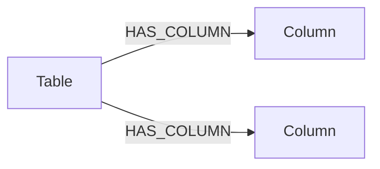

# Schema Intelligence KG

The Schema Intelligence KG describes incoming metadata-export schemas. It is intentionally separate from the Catalog KG and Event KG.

## Closed Graph Model



Only two node labels are allowed:

- `Table`
- `Column`

Only one relationship type is allowed:

- `(:Table)-[:HAS_COLUMN]->(:Column)`

A `Column` must have exactly one incoming `HAS_COLUMN` relationship and no outgoing relationships. Aliases, types, rules, warnings, descriptions, profile statistics, mapping decisions, confidence, contract versions, export IDs, and samples are node properties.

## Identity

Tables use the canonical table name from the mapping contract when available:

```text
datagalaxy_athena::<canonical_table_name>
```

Columns use the canonical field name when available, otherwise the observed raw name:

```text
<table_key>::<canonical_column_name_or_raw_name>
```

This lets a renamed raw column converge onto the same `Column` while preserving every nomination in `name_variants`.

## Column Properties

Important properties include:

- `column_name`
- `canonical_column_name`
- `raw_column_name`
- `name_variants`
- `description`
- `description_source`
- `observed_types`
- `rules`
- `warnings`
- `sample_values`
- `mapping_decision`
- `mapping_confidence`
- `requires_human_approval`
- `required_by_contract`
- `present_in_latest_export`
- `nullable_in_latest_export`
- `null_count`, `non_null_count`, `distinct_count`
- `export_ids`, `contract_versions`

Neo4j does not allow nested map values as ordinary node properties. Structured rules and observations are therefore normalized into descriptive string lists. Later agents may enrich these lists, but they must not create relationships from `Column` nodes.

## Build

Start the isolated graph:

```powershell
docker compose -f infra/docker-compose.schema-intelligence.yml up -d
```

Neo4j Browser is exposed on `http://127.0.0.1:7477` and Bolt on `bolt://127.0.0.1:7690`.

Build from a profiled export:

```powershell
.\.venv\Scripts\python.exe scripts\migration_v2\21_build_schema_intelligence_kg.py `
  --export-id dg_old_athena_test `
  --env-config configs\migration_v2\local_env.yaml
```

Use `--dry-run` to create the complete projection and reports without connecting to Neo4j.

## Outputs

- `schema_intelligence_projection.json`: complete deterministic Table/Column projection.
- `schema_intelligence_kg_report.json/md`: counts, missing contract columns, review counts, and graph audit.

The graph audit blocks success when it finds another node label, another relationship type, a column without exactly one table, or any outgoing relationship from a column.
