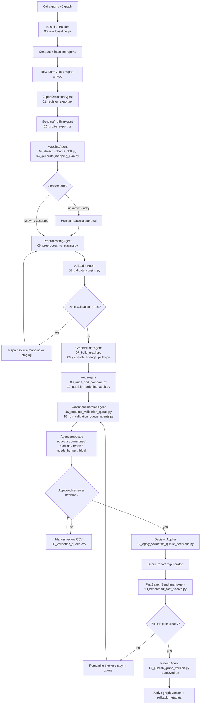

# Migration V2 Agent Workflow

This document explains the publish-governance workflow for migrated enterprise metadata knowledge graphs.
The design goal is simple: agents can inspect, explain, propose, and route anomalies, but only explicit approval can change publish gates.

## End-to-End Flow



## Agent Roles

| Agent | Job | Tools | Can mutate? | Human approval |
| --- | --- | --- | --- | --- |
| ExportDetectionAgent | Register raw files and detect the export boundary. | `01_register_export.py`, contract loader, file hashing | Yes, migration registry only | Not normally |
| SchemaProfilingAgent | Profile raw table columns, nulls, row counts, and shape drift. | `02_profile_export.py`, raw export profiler | Yes, report/staging metadata only | Required for unexpected drift |
| MappingAgent | Compare export schema to contract and propose mapping changes. | `03_detect_schema_drift.py`, `04_generate_mapping_plan.py`, mapping contract | No trusted graph mutation | Required for unknown columns or inferred mappings |
| PreprocessingAgent | Normalize raw rows into staging tables. | `05_preprocess_to_staging.py`, cleaners, normalizers, type parsers | Yes, staging only | Required if cleaning policy changes |
| ValidationAgent | Run deterministic staging checks. | `06_validate_staging.py`, validation rules | Yes, findings only | Required for open errors |
| GraphBuilderAgent | Build candidate typed graph from approved staging. | `07_build_graph.py`, graph builder, Neo4j schema | Yes, candidate graph only | Required before production publish |
| AuditAgent | Compare v2 graph with v0 baseline and generate anomaly reports. | `09_audit_and_compare.py`, `12_publish_hardening_audit.py`, graph auditor | Reports only | Required for parity exceptions |
| ValidationGuardianAgent | Review unresolved queue items with LLM or deterministic fallback and produce proposals. | `16_populate_validation_queue.py`, `18_run_validation_queue_agents.py`, Azure/OpenAI, validation queue | Proposals only | Always before decisions affect publish |
| DecisionApplier | Apply explicit reviewer-approved or explicitly authorized low-risk proposals. | `17_apply_validation_queue_decisions.py` | Yes, validation queue status only | Always requires `--approved-by` |
| FastSearchBenchmarkAgent | Verify read model, cache behavior, graph version headers, and latency. | `13_benchmark_fast_search.py`, API, Redis, Postgres search read model | Benchmark rows/reports only | Required before publish |
| PublishAgent | Publish only when all gates are ready. | `10_publish_graph_version.py`, search refresh function, publish reports | Yes, active search graph version | Always requires `--approved-by` |

## Current Governance Model

The validation queue is the control surface. Reports feed it, agents propose actions, and approval changes queue state.

Allowed queue policies:

- `accept`: keep the object or delta in the trusted graph, with documented rationale.
- `quarantine`: keep it traceable but do not treat it as trusted hierarchy/search evidence.
- `exclude`: remove from trusted publish surface by policy.
- `repair`: known technical issue that needs exact repair evidence.
- `needs_human`: not enough evidence for automatic decision.
- `block`: publish cannot proceed until resolved.

The agent is intentionally conservative:

- `HAS_FIELD -1` remains `repair` until the exact missing edge is known.
- `IMPLEMENTS -155` remains `needs_human` or `repair` until edge-level diff exists.
- High severity `accept` proposals are downgraded to `needs_human`.
- Placeholder/null paths are not silently accepted.

## Shared DQC Agent Governance

The DQC Resolution Agent follows the same production boundary as the migration agents:
it inspects evidence, explains match quality, persists proposals, and recommends reviewer actions, but chat does not approve or reject matches.

Allowed DQC proposal actions are:

- `approve_match`: reviewer may approve a high-confidence resolved match.
- `reject_match`: reviewer may reject unsafe match evidence.
- `keep_in_dlq`: unresolved event stays in DLQ.
- `search_alternatives`: reviewer should inspect other candidates or GraphRAG evidence.
- `replay_after_fix`: source data or catalog evidence must be corrected before replay.

DQC review decisions remain explicit API/UI actions under `/dqc-resolution/review/...`.
The DQC agent tool registry deliberately excludes approval and rejection tools.

## One-Command Agent Workflow

Use this when the queue already exists and you want the agent-assisted publish-readiness loop:

```powershell
.\.venv\Scripts\python.exe scripts\migration_v2\19_run_agent_publish_workflow.py `
  --export-id dg_old_athena_test `
  --env-config configs\migration_v2\local_env.yaml `
  --limit 200 `
  --apply-low-risk `
  --approved-by louat
```

Outputs:

- `reports/migration_v2/<export_id>/agent_publish_workflow_report.json`
- `reports/migration_v2/<export_id>/agent_publish_workflow_report.md`
- `reports/migration_v2/<export_id>/agent_validation_queue_proposals.json`
- `reports/migration_v2/<export_id>/manual_review_csv/10_agent_queue_proposals.csv`
- regenerated `validation_queue_report.json/md`
- regenerated `publish_report.json/md`

## When a New Export Arrives

1. Register it with the current contract.
2. Profile it and detect schema drift.
3. If drift is material, update or approve the contract before graph build.
4. Preprocess into staging.
5. Run deterministic staging validation.
6. Build candidate graph and lineage paths.
7. Audit against the old baseline and generate hardening reports.
8. Populate the validation queue.
9. Run ValidationGuardianAgent for evidence-backed proposals.
10. Apply only approved decisions or explicitly authorized low-risk proposals.
11. Run fast search benchmark.
12. Publish only when validation queue and fast search gates are both ready.

## Why This Is Not Hardcoded Migration Logic

The code does not bake in one-off answers like "always accept this node." It encodes governance policy:

- source evidence is stored per issue;
- agent proposals are persisted separately from queue decisions;
- approval is captured with approver and timestamp;
- queue rebuild preserves approved decisions;
- unresolved items remain visible and block publish according to policy;
- new exports re-enter the same queue/proposal/approval workflow.

That means a new export can bring new anomalies without forcing code changes. The system should classify what it can, propose what it cannot prove, and keep the unresolved cases in a validation queue instead of pretending the graph is perfect.
