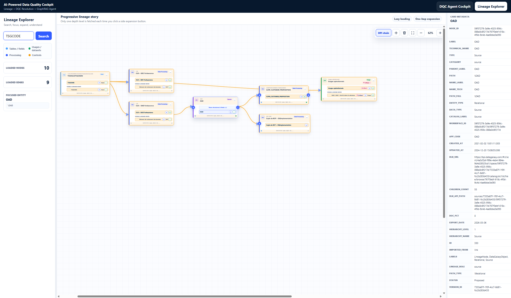
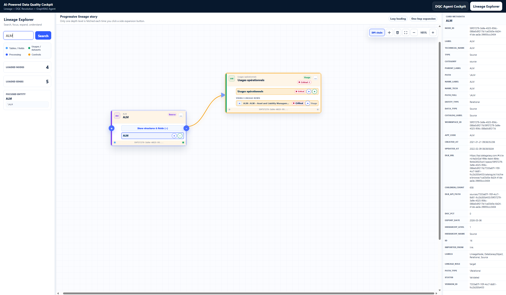

# AI-Powered Data Quality Cockpit Frontend

React and Vite frontend for the local DataGalaxy lineage and data-quality demo.

The interface has two workspaces:

- **DQC Agent Cockpit**: upload or connect quality checks, review matches, inspect unresolved items, and run agent investigations.
- **Lineage Explorer**: search catalog entities, progressively expand upstream or downstream lineage, inspect metadata, and highlight visible paths.

This project is currently intended for local demonstration and iterative development. Authentication and role management are deliberately out of scope for now.



## Quick Start

### Prerequisites

- Node.js and npm
- The backend API running on `http://127.0.0.1:8001`
- PostgreSQL, Neo4j, and Redis services required by the backend

### Configuration

The frontend reads the backend URL from:

```env
VITE_API_BASE_URL=http://127.0.0.1:8001
```

Use `.env.example` as the local template.

### Run the frontend

```powershell
npm install
npm run dev -- --host 127.0.0.1 --port 5176
```

Open `http://127.0.0.1:5176`, then select **Lineage Explorer** in the top switcher.

### Validate a change

```powershell
npm run typecheck
npm run build
```

## Lineage Explorer Behavior

The graph is intentionally demand-driven. It fetches one lineage depth when the user explicitly requests it.

| Control | Meaning |
| --- | --- |
| `Show structures & fields (+)` | Load only catalog rows inside a source card. It does not open DPI or usage cards. |
| Small square `+` or `-` | Reveal or hide nested catalog rows inside the current card. |
| Blue circular `+` or `-` | Expand or collapse upstream lineage. |
| Green circular `+` or `-` | Expand or collapse downstream lineage. |
| `Show more` | Reveal additional already-loaded rows inside the current card. |
| `Load more structures & fields` | Fetch the next catalog page for a large source. |

Cards use compact one-line rows with ellipsis. Expanded cards are measured dynamically and moved when necessary so that cards do not overlap.

## TSGCODE Demo

The reference walkthrough starts from:

```text
\CLB\TRESIMMO\TSIGNALETIQUEGEN\TSGCODE
```

Its highlighted example contains a processing branch, a usage folder, and a
direct field-to-usage dependency:

```text
Main processing branch:
TSGCODE
  -> CLB > OAD Forbearance / Element de traitement de donnees
  -> OAD source
  -> OAD : OAD - Outil d'aide a la decision

Usage containment:
Usages operationnels
  -> contains OAD : OAD - Outil d'aide a la decision

Additional stored shortcut:
TSGCODE
  -> is used by OAD : OAD - Outil d'aide a la decision
```

See [docs/USER_GUIDE.md](docs/USER_GUIDE.md) for the complete click-by-click walkthrough.

## ALM Source-to-Usage Demo

For a shorter source-to-usage demonstration, start from the `ALM` source:

```text
\ALM
```

Its highlighted result is intentionally compact:

```text
ALM source
  -> Usages operationnels
     -> contains ALM : ALM - Asset and Liability Management
```



Search for `ALM`, select the source card, then click its green downstream `+`.
The explorer draws the source dependency explicitly while keeping the concrete
application folded into its `Usages operationnels` parent card.

## Screenshot Regeneration

With the backend on port `8001` and the frontend on port `5176`, regenerate the documented screenshots with:

```powershell
..\.venv\Scripts\python.exe scripts\capture_tsgcode_lineage_screenshot.py
..\.venv\Scripts\python.exe scripts\capture_alm_source_usage_screenshot.py
```

The helpers use an installed Chrome or Edge browser and write:

```text
docs/images/tsgcode-highlighted-lineage.png
docs/images/alm-source-to-usage-highlighted.png
```

## Project Structure

```text
src/
  App.jsx                         Workspace switcher and DQC cockpit
  features/lineage/
    api/                          Lineage API client
    components/                   Search, cards, canvas, metadata, highlighting
    hooks/                        Progressive lineage state and fetching
    utils/                        Grouping, layout, filtering, styling
docs/
  USER_GUIDE.md                   End-user walkthrough
  images/                         Documentation screenshots
scripts/
  capture_alm_source_usage_screenshot.py
  capture_tsgcode_lineage_screenshot.py
```
